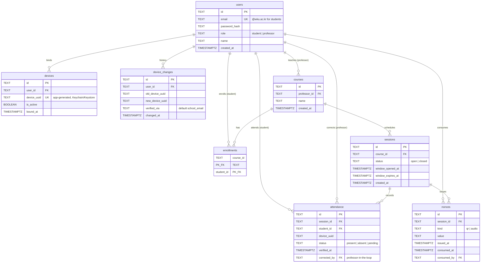

# Syncattend (SDAS) — Database Schema

Source of truth: `backend/migrations/0001_initial_schema.sql` (owner **A**), kept
in lockstep with `backend/app/models.py` (ORM) and `contracts/openapi.yaml`.

- **PostgreSQL** (prod) + **SQLite** (tests) — all IDs and device UUIDs are
  stored as `TEXT` (36-char UUID strings) for cross-DB portability. The app
  generates ids as `uuid4()` strings; native `UUID` columns caused
  `column is of type uuid but expression is of type character varying` on every
  INSERT, so `TEXT` keeps SQL and ORM aligned.
- **Redis** holds the short-lived, high-churn data that never needs to persist:
  rotating QR / audio nonces (15s TTL, single-use) and device re-registration
  email codes (TTL). The `nonces` table below is only an optional **audit trail**
  of consumed nonces for relay-attack forensics.

> Verified against the running compose Postgres (`sdas`/`sdas`): all 8 tables and
> the defense constraints below exist as documented.

## ER diagram

## Tables

### `users` — accounts (students & professors)
| column | type | notes |
|--------|------|-------|
| id | TEXT PK | uuid4 string |
| email | TEXT UNIQUE | students use `@wku.ac.kr` |
| password_hash | TEXT | |
| role | TEXT | CHECK `('student','professor')` |
| name | TEXT | |
| created_at | TIMESTAMPTZ | default `now()` |

### `devices` — app-generated UUID binding (identity defense axis 1)
| column | type | notes |
|--------|------|-------|
| id | TEXT PK | |
| user_id | TEXT FK → users | `ON DELETE CASCADE` |
| device_uuid | TEXT **UNIQUE** | app-generated, stored in Keychain/Keystore |
| is_active | BOOLEAN | default true |
| bound_at | TIMESTAMPTZ | |

- **`UNIQUE(device_uuid)`** = one UUID belongs to exactly one account.
- "One active device per account" and "one active binding per UUID" are enforced
  in the **app layer** (`routers/devices.py`), not by a DB partial unique — a
  unique on `(user_id, is_active)` would break re-registration, which
  intentionally leaves multiple `is_active=false` rows.
- A new/unknown UUID must pass `@wku.ac.kr` email re-auth before binding.

### `device_changes` — device swap audit (anomaly detection)
`old_device_uuid → new_device_uuid`, `verified_via` (default `school_email`),
`changed_at`. Forensic trail for relay/loaner-phone abuse.

### `courses` + `enrollments` — courses & registration
- `courses`: `professor_id` FK, `name`.
- `enrollments`: composite `PRIMARY KEY(course_id, student_id)` — prevents
  double-enrollment; models the N:M between courses and students.

### `sessions` — attendance session (professor-opened ~60s auth window)
`course_id` FK, `status` (`open`/`closed`), `window_opened_at`,
`window_expires_at`. Extendable via `extendWindow`, ended via `closeSession`.

### `attendance` — attendance records (final proxy-attendance gate)
| column | type | notes |
|--------|------|-------|
| id | TEXT PK | |
| session_id | TEXT FK → sessions | |
| student_id | TEXT FK → users | |
| device_uuid | TEXT | the UUID that verified |
| status | TEXT | CHECK `('present','absent','pending')` |
| verified_at | TIMESTAMPTZ | |
| corrected_by | TEXT FK → users | professor manual correction |

- **`UNIQUE(session_id, student_id)`** — one attendance per account per session.
- **`UNIQUE(session_id, device_uuid)`** — one attendance per device per session
  (a single phone cannot check in for multiple accounts → proxy-attendance block).

### `nonces` — consumed-nonce audit trail (optional)
Rotating nonces live in **Redis** (15s TTL, single-use). This table records
consumed nonces for forensics: `kind` (`qr`/`audio`), `value`, `issued_at`,
`consumed_at`, `consumed_by`, with `UNIQUE(session_id, kind, value)`.

## Indexes
`idx_devices_user(user_id)`, `idx_sessions_course(course_id)`,
`idx_attendance_session(session_id)`, `idx_nonces_session(session_id)`.

## How the layered defense maps to the schema

| Defense layer | Enforced at |
|---------------|-------------|
| Rotating QR token (15s TTL, single-use) | Redis (audited in `nonces`) |
| Ultrasonic audio nonce (18–20 kHz) | Redis + `nonces` audit |
| Device UUID binding | `devices.UNIQUE(device_uuid)` |
| One check-in per account / per device per session | `attendance.UNIQUE(session_id, student_id)` + `UNIQUE(session_id, device_uuid)` |
| Professor-in-the-loop confirmation | `attendance.corrected_by` |
| Device-change / anomaly audit | `device_changes` |

## Storage split
- **PostgreSQL** — all 8 persistent tables above.
- **Redis** — volatile short-lived data: rotating QR/audio nonces (15s TTL,
  single-use) and re-registration email codes (TTL).
